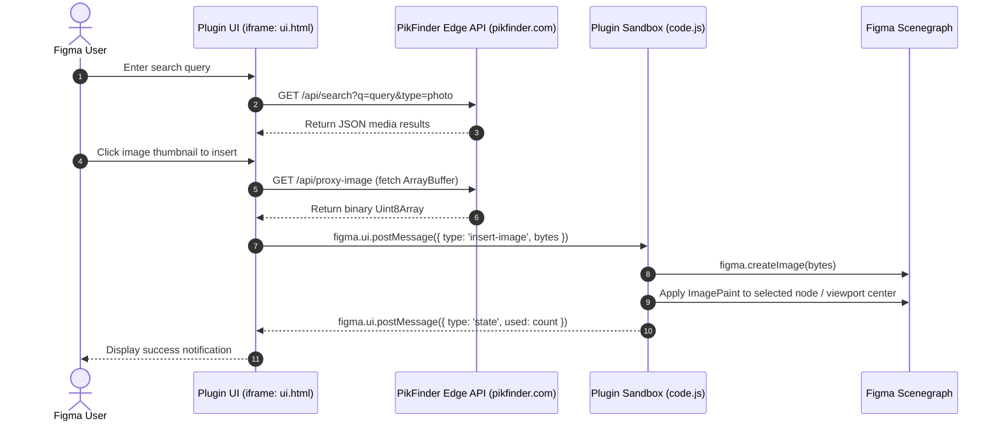

<div align="center">

  <h1>PikFinder for Figma</h1>

  <p align="center">
    <strong>Search millions of free, copyright-safe stock photos & videos and insert them onto your Figma canvas in one click.</strong>
  </p>

  <p align="center">
    <a href="https://www.figma.com/community/plugin/1663285303127319860" target="_blank">
      
    </a>
    <a href="https://www.pikfinder.com" target="_blank">
      
    </a>
    <a href="LICENSE">
      
    </a>
  </p>

</div>

---

## 💡 Overview

**PikFinder for Figma** is an official Community plugin designed to eliminate the context-switching friction of downloading stock assets from a browser and dragging them into Figma.

With PikFinder, designers can search across 5 global stock photo & video libraries (**Unsplash, Pexels, Pixabay, Openverse, and Wikimedia Commons**) directly from inside Figma and drop them onto existing shapes or create fresh responsive frames.

---

## ✨ Key Features

- 🔍 **Multi-Provider Search:** Query millions of high-resolution, copyright-cleared photos, videos, and vector graphics simultaneously.
- ⚡ **1-Click Smart Insertion:**
  - **Selected Shape:** If a frame or rectangle is selected, the plugin automatically applies the image as a high-density `IMAGE` fill with proper aspect crop.
  - **No Selection:** Places a new proportional rectangle at the exact center of the current user viewport.
- 🎬 **Video Poster Extraction:** Previews videos and automatically extracts the high-resolution poster frame onto the canvas.
- 🔒 **CORS-Safe Binary Pipeline:** Uses a high-throughput proxy buffer to stream binary `ArrayBuffer` data into `figma.createImage()`.
- 💾 **Persistent Client Quota Engine:** Tracks daily insert usage and Pro licence verification persistently via `figma.clientStorage` across sessions.

---

## 🏗️ Architecture & Engineering Design

Figma plugins run in a dual-thread sandboxed environment:



### Technical Highlights:
1. **Asynchronous Binary Serialization:** Figma's UI runs in an isolated `iframe` without direct access to the document scenegraph. Image payloads are fetched as `ArrayBuffer` chunks, converted to `Uint8Array`, and transferred over `postMessage` with zero memory leaks.
2. **Viewport Centering Calculus:** Automatically computes `figma.viewport.center` and clamps large dimensions (capped at 900px width with preserved aspect ratio) to keep new canvas elements immediately visible.
3. **Session State & Licence Persistence:** Reads and writes to `figma.clientStorage` asynchronously on startup to hydrate user state without network latency.

---

## 🚀 Local Development Setup

Want to run or customize this plugin locally in Figma Desktop?

### 1. Prerequisites
- **Figma Desktop App** (macOS or Windows)

### 2. Import into Figma
1. Clone this repository:
   ```bash
   git clone https://github.com/mrsunnysingh/pikfinder-figma-plugin.git
   cd pikfinder-figma-plugin
   ```
2. Open the **Figma Desktop App**.
3. Open any design file.
4. Click the Figma Menu (top-left) → **Plugins → Development → Import plugin from manifest…**
5. Select the `manifest.json` file inside this repository folder.
6. The plugin is now instantly available under **Plugins → Development → PikFinder — Free Stock Media**.

---

## 📦 Project File Structure

```
pikfinder-figma-plugin/
├── manifest.json       # Plugin metadata, permissions, entry points & network rules
├── code.js             # Figma Sandbox thread (creates canvas nodes, image fills, storage)
├── ui.html             # Standalone UI panel (search bar, tab navigation, grid layout)
├── assets/             # Brand logos and plugin cover graphics
├── package.json        # Manifest typings and metadata
├── README.md           # Project documentation and engineering guide
└── LICENSE             # MIT Open-Source License
```

---

## 👨‍💻 Author & Portfolio

Built by **[Sunny Kumar Singh](https://github.com/mrsunnysingh)**

- **Live Product:** [pikfinder.com](https://www.pikfinder.com)
- **Figma Plugin:** [Install on Community](https://www.figma.com/community/plugin/1663285303127319860)
- **LinkedIn:** [linkedin.com/in/sunny-kumar-singh](https://www.linkedin.com/in/mrsunnysingh)
- **GitHub:** [@mrsunnysingh](https://github.com/mrsunnysingh)

---

## 📄 License

This project is licensed under the [MIT License](LICENSE).
